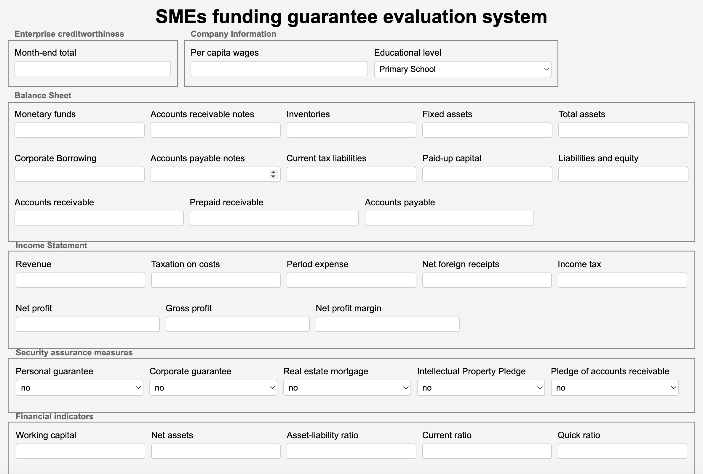

## README

[English README](./README.md)

​	该分支存储LEAF模型（基于LIME的特征增强）和SFA模型（基于SHAP的特征增强）和基于该模型的初代系统，该初代系统是通过eel进行前后端交互的。

​	共存储三个版本：系统1--LEAF初代系统中文本（接入文本向量）、系统2--LEAF初代系统英文版（接入文本向量）、LEAF模型算法、LEAF模型算法（接入文本向量）、SFA模型算法（接入文本向量）

#### 1）系统1-- LEAF初代系统中文版（接入文本向量）：[LEAF-预测文本向量-系统版本-中文版]

#### 2）系统2-- LEAF初代系统英文版（接入文本向量）：[LEAF-预测文本向量-系统版本-英文版]

#### 3）LEAF模型算法：[LEAF模型算法]

​	为了有效扩充已有特征，本算法采用LIME生成了一个新的特征集，即增强特征集(augmented feature set, AFS)。同时，为了充分利用原始数据的预测结果，我们使用初始特征集(original feature set, OFS)训练了一个模型，并得到了相应的预测结果，即out-of-fold (OOF)预测概率。接下来，我们针对OFS和AFS分别训练了两个第二阶段模型，并通过特征筛选得到了经过筛选后的样本数据base'和经过筛选后的LIME数据LIME'。然后，我们分别构建了经过特征筛选后的数据集，即改进的原始特征集(OFS')和改进的增强特征集(AFS')。最后，我们将OFS'和AFS'合并，构建了最终特征集(final feature set, FFS)，并训练了第三阶段模型。在预测阶段，我们将第一阶段模型的输出和第三阶段模型的输出进行平均集成，以提升泛化能力，并得到最终的预测结果。

#### 4）LEAF模型算法（接入文本向量）：[LEAF-预测文本向量]

#### 5）LEAF模型算法-不含P（预测概率）：[SFA-text-lime-只有lime没有p]

#### 6）SFA模型算法：[SFA-text-shap]

 	将LIME换成SHAP，利用SHAPley value作为特征增强，并接入文本向量作为补充。

#### 7）SFA模型算法（接入文本向量）：[SFA-text-shap-接文本向量]