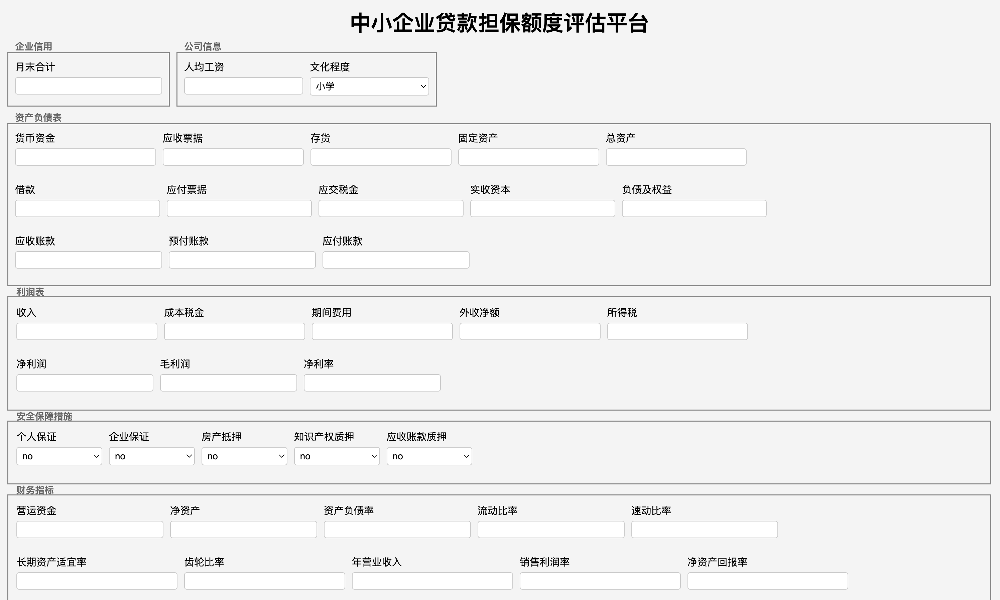
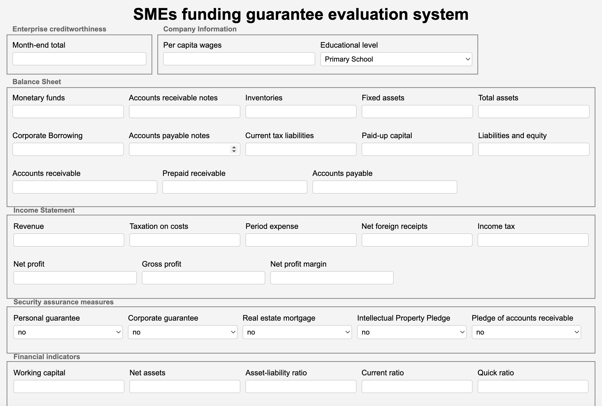
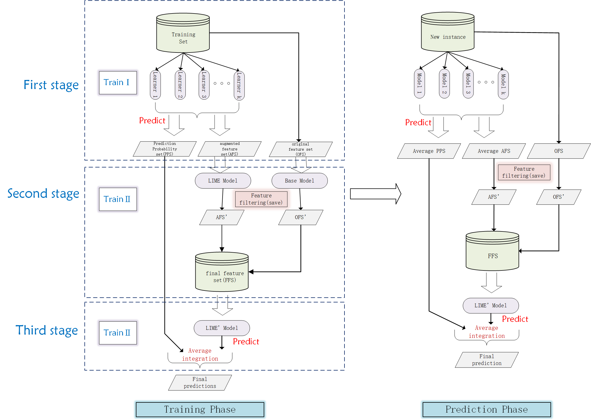
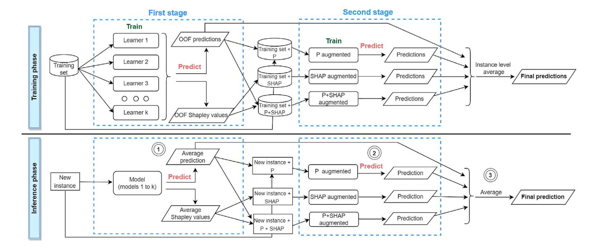

## README

[中文文档](./README-zh.md)

This branch stores the LEAF model (LIME-based feature enhancement) and the SFA model (SHAP-based feature enhancement), along with the initial system based on these models. This initial system uses `eel` for front-end and back-end interaction.

A total of three versions are stored: System 1—LEAF initial system Chinese version (with text vector integration), System 2—LEAF initial system English version (with text vector integration), LEAF model algorithm, LEAF model algorithm (with text vector integration), and SFA model algorithm (with text vector integration).

#### 1) System 1—LEAF Initial System Chinese Version (with Text Vector Integration): [LEAF-Predictive Text Vector-System Version-Chinese]

#### 2) System 2—LEAF Initial System English Version (with Text Vector Integration): [LEAF-Predictive Text Vector-System Version-English]

#### 3) LEAF Model Algorithm: [LEAF Model Algorithm]

To effectively expand the existing features, this algorithm uses LIME to generate a new feature set, namely the Augmented Feature Set (AFS). Meanwhile, to fully leverage the prediction results of the original data, we trained a model using the Original Feature Set (OFS) and obtained the corresponding prediction results, i.e., out-of-fold (OOF) prediction probabilities. Next, we trained two second-stage models for OFS and AFS separately and performed feature selection to obtain the filtered sample data `base'` and filtered LIME data `LIME'`. Then, we constructed the improved datasets after feature selection, namely the Improved Original Feature Set (OFS') and the Improved Augmented Feature Set (AFS'). Finally, we combined OFS' and AFS' to build the Final Feature Set (FFS) and trained a third-stage model. In the prediction phase, we averaged the outputs of the first-stage model and the third-stage model to improve generalization ability and obtain the final prediction results.

#### 4) LEAF Model Algorithm (with Text Vector Integration): [LEAF-Predictive Text Vector]

#### 5) LEAF Model Algorithm—Without P (Prediction Probability): [SFA-text-lime-Only LIME Without P]

#### 6) SFA Model Algorithm: [SFA-text-shap]

Replace LIME with SHAP, using SHAPley values for feature enhancement, and integrate text vectors as a supplement.

#### 7) SFA Model Algorithm (with Text Vector Integration): [SFA-text-shap-with Text Vector]

